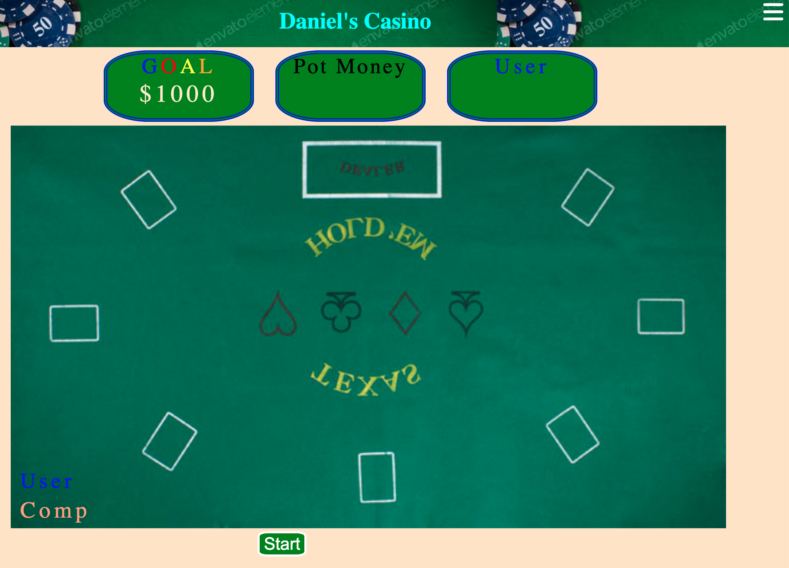

# project-1

[texas holdem] (project1.png)

MVP Goals

- User will start with $100
- Computer will Call every time, He will not fold.. (If It's possible ill make it random(computer has good cards) call or (computer got bad cards) fold)
- User can only bat $5 every turn.
- User Goal is making $1000
- If user got Royal Straight Flush , double up the batting money
- If user don't have money, user can use cash shop.(It's on top of the right side)
- After press Open Card button, it will start new game automatic 3seconds later
- press start button to start game
